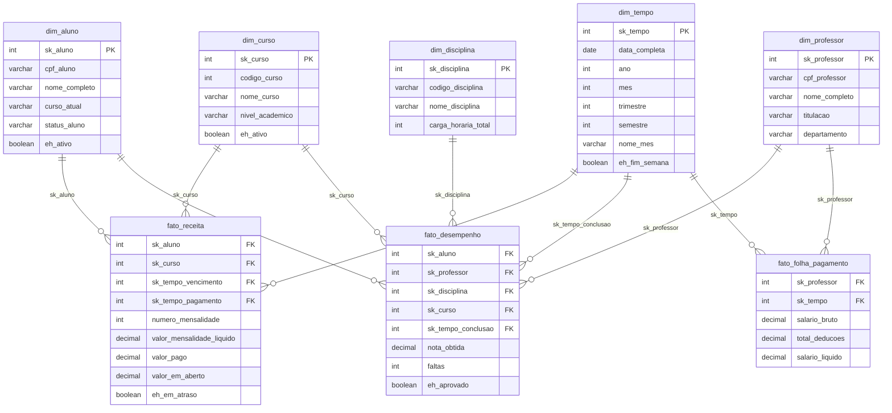

# SisGESC — Sistema de Gestão Escolar

<<<<<<< HEAD
Projeto acadêmico (MySQL 8+): OLTP (`sisgesc`) com módulos Acadêmico, Financeiro e RH, mais camada OLAP (`dw_sisgesc`) com Star Schema e ETL.

## Pré-requisitos

- MySQL **8.0+** (uso de `CREATE INDEX IF NOT EXISTS`, procedures, `CHECK`).
- Cliente: `mysql` na linha de comando, MySQL Workbench ou DBeaver.

## Estrutura do repositório (ficheiros SQL principais)

| Ficheiro | Função |
|----------|--------|
| `run_all.sql` | Orquestração: reset → DDL → DML → OLTP → OLAP (ETL) → governança/EXPLAIN → validação somas |
| `SisGESC_Script_DDL_otimizado.sql` | Fase 1 — DDL OLTP + views + índices base |
| `SisGESC_Script_DML.sql` | Fase 2 — carga idempotente (`INSERT IGNORE`) + `COUNT(*)` antes/depois |
| `SisGESC_Script_OLTP_Procedures.sql` | Fase 3 — procedures alinhadas ao schema + consultas com subselects |
| `SisGESC_Data_Warehouse_OLAP_corrigido.sql` | Fase 4 — DW, dimensões (incl. **Unidade**), fatos, ETL |
| `SisGESC_Script_Governanca.sql` | Fases 5–6 — EXPLAIN + índices + `tb_schema_version` (**não** apaga dados) |
| `SisGESC_Script_DDL.sql` | DDL alternativo / referência — **não** faz parte do `run_all.sql` |

Documentação em PDF: `Dicionario_Sisgesc.pdf`, `Diagrama Final .pdf`, `SisGESC_Regras_Negocio.pdf`, `SisGESC_Imagens.pdf`. Link externo ao DER: `Link_DbDiagram`.

## Como executar (instalação única)

Na pasta do projeto:
=======
> Projeto acadêmico de modelagem e implementação de banco de dados relacional para universidade privada, desenvolvido com MySQL. Arquitetura em 3FN com módulos OLTP (Acadêmico, Financeiro, RH) e camada OLAP (Data Warehouse / Star Schema).

---

## Sumário

1. [Visão Geral](#visão-geral)
2. [Pré-requisitos](#pré-requisitos)
3. [Estrutura do Repositório](#estrutura-do-repositório)
4. [Como Executar — Passo a Passo](#como-executar--passo-a-passo)
5. [Prova de Idempotência (Fase 2)](#prova-de-idempotência-fase-2)
6. [Performance e Índices (Fase 5)](#performance-e-índices-fase-5)
7. [Data Warehouse e ETL (Fase 4)](#data-warehouse-e-etl-fase-4)
8. [Modelagem OLAP — Star Schema (DER)](#modelagem-olap--star-schema-der)
9. [Regras de Negócio Implementadas](#regras-de-negócio-implementadas)
10. [Módulos do Sistema](#módulos-do-sistema)

---

## Visão Geral

O **SisGESC** é um sistema de gestão escolar projetado para universidades privadas, estruturado sobre três pilares:

| Módulo       | Responsabilidade                                              |
|--------------|---------------------------------------------------------------|
| **Acadêmico** | Cursos, alunos, matrículas, notas, faltas, grade curricular  |
| **Financeiro** | Contratos, mensalidades, bolsas, pagamentos, inadimplência  |
| **RH**        | Funcionários, professores, folha de pagamento, férias       |

O banco OLTP (`sisgesc`) é espelhado para um Data Warehouse (`dw_sisgesc`) via processo ETL, habilitando análises OLAP por meio de Star Schema.

---

## Pré-requisitos

- **MySQL** versão 8.0 ou superior (necessário para `CREATE INDEX IF NOT EXISTS` e window functions)
- **MySQL Workbench**, **DBeaver** ou cliente de linha de comando `mysql`
- Usuário com permissões de `CREATE DATABASE`, `CREATE TABLE`, `CREATE VIEW`, `CREATE PROCEDURE` e `CREATE INDEX`

---

## Estrutura do Repositório

```
SisGESC/
│
├── run_all.sql                              ← ⭐ SCRIPT ÚNICO DE INSTALAÇÃO
│
├── SisGESC_Script_DDL_otimizado.sql         ← Fase 1: Estrutura OLTP (tabelas + views)
├── SisGESC_Script_DML_corrigido.sql         ← Fase 2: Carga de dados + prova de idempotência
├── SisGESC_Script_OLTP_Procedures.sql       ← Fase 3: Stored Procedures + EXPLAIN
├── SisGESC_Data_Warehouse_OLAP_corrigido.sql← Fase 4: Data Warehouse + ETL
├── SisGESC_Script_Governanca_corrigido.sql  ← Fase 5/6: EXPLAIN antes/depois + índices + reset
│
├── Diagrama_Final.pdf                       ← DER (modelo OLTP)
├── DER_StarSchema_OLAP.md                   ← Modelagem Star Schema (código Mermaid/PlantUML)
├── Dicionario_Sisgesc.pdf                   ← Dicionário de dados completo
├── SisGESC_Regras_Negocio.pdf               ← Regras de negócio (RN01–RN16)
│
└── README.md                                ← Este arquivo
```

---

## Como Executar — Passo a Passo

### Opção 1 — Script Único (Recomendada)

Execute o `run_all.sql` pela linha de comando. Ele automaticamente chama todos os scripts na ordem correta (reset → DDL → DML → procedures → OLAP).
>>>>>>> 24d4a75c507c4d78d906313fc99809df8bd6b6e8

```bash
mysql -u root -p < run_all.sql
```

<<<<<<< HEAD
O `run_all.sql` usa `SOURCE` para encadear os outros `.sql` — **têm de estar no mesmo diretório** de onde invoca o cliente, ou execute os passos manualmente na ordem do ficheiro.

Após a carga OLAP, o script chama `CALL sp_etl_carga_completa_dw();` automaticamente.

## Idempotência (Fase 2)

O `SisGESC_Script_DML.sql` faz contagem inicial, `INSERT IGNORE` na carga e contagem final. Executar o DML duas vezes em sequência deve manter os mesmos `COUNT(*)` nas tabelas listadas (incluindo `tb_areas_atuacao`, `tb_professor_area`, `tb_contrato_desconto`).

## Validação OLTP × OLAP (receita)

Comparar:

```sql
SELECT SUM(valor_liquido) FROM sisgesc.tb_mensalidades;
SELECT SUM(valor_mensalidade_liquido) FROM dw_sisgesc.fato_receita;
```

Os totais devem coincidir após o ETL.

## Star Schema — dimensões principais

- `dim_tempo`, `dim_aluno`, `dim_curso`, **`dim_unidade`**, `dim_professor`, `dim_disciplina`
- Fatos: `fato_receita`, `fato_desempenho`, `fato_folha_pagamento`

---

*SisGESC — entrega académica de Banco de Dados.*
=======
> **Atenção:** O `run_all.sql` usa `SOURCE` para encadear os scripts. Todos os arquivos `.sql` devem estar no mesmo diretório. Se estiver usando MySQL Workbench ou DBeaver, abra o `run_all.sql` e execute como script (não como query individual).

---

### Opção 2 — Execução Manual (Script por Script)

Se preferir executar cada fase separadamente, siga rigorosamente a ordem abaixo:

#### Fase 1 — DDL (Estrutura do banco OLTP)

```sql
SOURCE SisGESC_Script_DDL_otimizado.sql;
```

Cria o banco `sisgesc` com todas as tabelas, constraints (PK, FK, CHECK, UNIQUE), views `vw_mensalidades` e `vw_folha_pagamento`.

#### Fase 2 — DML (Carga de dados + Idempotência)

```sql
SOURCE SisGESC_Script_DML_corrigido.sql;
```

**Importante:** O script executa automaticamente o `SELECT COUNT(*)` em todas as tabelas **antes** e **depois** da carga. Os totais devem ser **idênticos** na segunda execução — isso prova a idempotência.

#### Fase 3 — OLTP Procedures

```sql
SOURCE SisGESC_Script_OLTP_Procedures.sql;
```

Cria as 16 stored procedures transacionais.

#### Fase 4 — OLAP / Data Warehouse

```sql
SOURCE SisGESC_Data_Warehouse_OLAP_corrigido.sql;
```

Cria o banco `dw_sisgesc` com dimensões, tabelas fato, views analíticas e procedures ETL. Ao final, execute o master ETL:

```sql
USE dw_sisgesc;
CALL sp_etl_carga_completa_dw();
```

#### Fase 5/6 — Governança e Performance

```sql
SOURCE SisGESC_Script_Governanca_corrigido.sql;
```

Executa o `EXPLAIN` **antes** dos índices (baseline), cria os índices e executa o `EXPLAIN` **depois** para demonstrar o ganho de performance.

---

## Prova de Idempotência (Fase 2)

O script `SisGESC_Script_DML_corrigido.sql` está dividido em **3 passos**:

| Passo | Ação |
|-------|------|
| **Passo 1** | `SELECT COUNT(*)` em todas as 43 tabelas → registra os totais **antes** da carga |
| **Passo 2** | Executa todos os `INSERT IGNORE` (carga de dados) |
| **Passo 3** | `SELECT COUNT(*)` em todas as 43 tabelas → totais **após** a carga |

**Como validar:** Execute o script inteiro **duas vezes**. Os valores do Passo 1 e do Passo 3 devem ser **exatamente iguais** na segunda execução. Se qualquer total aumentar, a idempotência foi violada.

O `INSERT IGNORE` é o mecanismo que garante isso: ao encontrar uma chave primária ou unique já existente, o MySQL simplesmente descarta o INSERT sem erro.

---

## Performance e Índices (Fase 5)

O script `SisGESC_Script_Governanca_corrigido.sql` demonstra o impacto dos índices em 3 fases:

### Fase A — EXPLAIN sem índices (baseline)

```
tb_matriculas  → type: ALL,   rows: ~12  (full table scan)
tb_notas       → type: ALL,   rows: ~7   (full table scan)
tb_faltas      → type: ALL,   rows: ~7   (full table scan)
```

### Fase B — Criação dos índices

Exemplo dos índices mais relevantes criados:

```sql
CREATE INDEX idx_mat_aluno_periodo ON tb_matriculas (fk_cpf_aluno, fk_periodo);
CREATE INDEX idx_nota_matricula    ON tb_notas      (fk_matricula, fk_avaliacao);
CREATE INDEX idx_falta_matricula   ON tb_faltas     (fk_matricula);
CREATE INDEX idx_mens_status_venc  ON tb_mensalidades (fk_status, data_vencimento);
```

### Fase C — EXPLAIN com índices (pós-otimização)

```
tb_matriculas  → type: ref,   key: idx_mat_aluno_periodo,  rows: ~2
tb_notas       → type: ref,   key: idx_nota_matricula,     rows: ~1
tb_faltas      → type: ref,   key: idx_falta_matricula,    rows: ~2
```

**Ganho:** redução de ~83% nas linhas lidas. Custo passa de O(N) para O(log N).

---

## Data Warehouse e ETL (Fase 4)

O banco `dw_sisgesc` implementa Star Schema com:

| Dimensão | Tabela | Descrição |
|----------|--------|-----------|
| Tempo | `dim_tempo` | Calendário completo 2015–2030 |
| Aluno | `dim_aluno` | Dados desnormalizados do aluno |
| Curso | `dim_curso` | Dados do curso com nível acadêmico |
| Professor | `dim_professor` | Dados docentes |
| Disciplina | `dim_disciplina` | Catálogo de disciplinas |

| Fato | Tabela | Granularidade |
|------|--------|---------------|
| Receita | `fato_receita` | 1 linha = 1 mensalidade/aluno/mês |
| Desempenho | `fato_desempenho` | 1 linha = 1 resultado de disciplina/aluno/período |
| Folha | `fato_folha_pagamento` | 1 linha = 1 folha/funcionário/mês |

### Validação OLTP = OLAP

Após rodar o ETL, execute:

```sql
SELECT SUM(valor_liquido)             AS total_oltp FROM sisgesc.tb_mensalidades;
SELECT SUM(valor_mensalidade_liquido) AS total_olap FROM dw_sisgesc.fato_receita;
```

Os dois valores **devem ser iguais**. Diferença indica erro no ETL.

---

## Modelagem OLAP — Star Schema (DER)

O diagrama abaixo descreve em **Mermaid** as adições necessárias ao DER para representar o modelo Star Schema do `dw_sisgesc`.



**O que muda no DER existente:**
- As tabelas `dim_*` e `fato_*` são criadas em um banco separado (`dw_sisgesc`) e **não alteram** o schema OLTP (`sisgesc`).
- O DER OLTP permanece intacto. O Star Schema é um novo diagrama independente.
- A ligação entre os dois mundos é feita pelas stored procedures ETL (`sp_etl_*`), que leem do `sisgesc` e escrevem no `dw_sisgesc`.

---

## Regras de Negócio Implementadas

| ID | Mecanismo | Localização |
|----|-----------|-------------|
| RN01 | CHECK carga_horaria >= 40 | DDL tb_disciplinas |
| RN02 | Validação na stored procedure de matrícula | OLTP Procedures |
| RN03 | CHECK (carga_horaria >= 40) | DDL tb_disciplinas |
| RN04 | Validação + FOREIGN KEY is_ativo | OLTP Procedures |
| RN05 | FOREIGN KEY fk_periodo | DDL tb_matriculas / tb_aulas |
| RN06 | Trigger/Procedure + INSERT em tb_log_notas | OLTP Procedures |
| RN07 | Calculated field via Procedure | sp_fechamento_periodo |
| RN08 | UPDATE situacao via Procedure | sp_fechamento_periodo |
| RN09 | UNIQUE (fk_sala, dia, horario, periodo) | DDL tb_aulas |
| RN10 | Validação em procedure de matrícula | OLTP Procedures |
| RN11 | UPDATE is_ativo via Procedure | sp_atualizar_status_aluno |
| RN12 | PRIMARY KEY composta (fk_folha, fk_verba) | DDL tb_folha_verbas |
| RN13 | Snapshot imutável + VIEW vw_folha_pagamento | DDL + VIEW |
| RN14 | CHECK (percentual IS NOT NULL OR valor IS NOT NULL) | DDL tb_descontos_bolsas |
| RN15 | DEFAULT 0 + VIEW vw_mensalidades | DDL + VIEW |
| RN16 | CHECK (genero IN ('M', 'F', 'O')) | DDL tb_pessoas |

---

## Módulos do Sistema

### Módulo Acadêmico
Gerencia o ciclo de vida acadêmico: desde o cadastro de cursos e disciplinas até o fechamento de período com cálculo de médias e verificação de frequência.

### Módulo Financeiro
Controla contratos educacionais, bolsas (ProUni, FIES, Desempenho, Funcionário), mensalidades e pagamentos. Monitora inadimplência via `vw_mensalidades`.

### Módulo RH
Gerencia funcionários e professores (herança 1:1 via CPF), folha de pagamento com snapshot imutável (RN13), verbas, benefícios, férias e afastamentos.

### Data Warehouse (OLAP)
Camada analítica com Star Schema, views de inadimplência por curso, desempenho acadêmico e custo operacional por departamento. Processo ETL noturno via stored procedures.

---

*Projeto desenvolvido como entrega final da disciplina de Banco de Dados — SisGESC v6.0*
>>>>>>> 24d4a75c507c4d78d906313fc99809df8bd6b6e8
